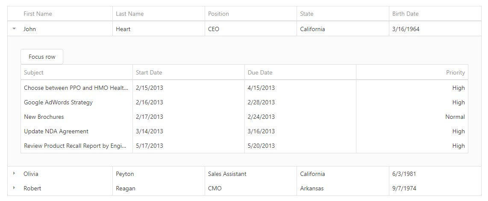

<!-- default badges list -->

<!-- default badges end -->
# DevExtreme DataGrid - How to access every Master-Detail grid from code

This example illustrates how to access the detail DataGrid instance from the [onClick](https://js.devexpress.com/Documentation/ApiReference/UI_Widgets/dxButton/Configuration/#onClick) event handler of the button placed to the [masterDetail template](https://js.devexpress.com/Documentation/ApiReference/UI_Widgets/dxDataGrid/Configuration/masterDetail/#template).

The main idea is to generate every detail grid's `id` dynamically so that we can address the grid's instance in the `onClick` event handler later. Although this example is focused on the DataGrid widget, the same approach is applicable for any other widget placed into the masterDetail template.

<!-- run online -->
**[[Run Online]](https://codecentral.devexpress.com/198618838/)**
<!-- run online end -->

## Files to Review

- **Angular**
    - [app.component.html](angular/src/app/app.component.html)
    - [app.component.ts](angular/src/app/app.component.ts)
- **jQuery**
    - [index.js](jquery/index.html)
- **React**
    - [App.js](react/src/App.js)
- **Vue**
    - [App.vue](vue/src/App.vue)

## Documentation

- [Getting Started with DataGrid](https://js.devexpress.com/Documentation/Guide/UI_Components/DataGrid/Getting_Started_with_DataGrid/)

- [DataGrid - Master-Detail Interface](https://js.devexpress.com/Documentation/Guide/UI_Components/DataGrid/Master-Detail_Interface/)

- [DataGrid - API Reference](https://js.devexpress.com/Documentation/ApiReference/UI_Components/dxDataGrid/)

